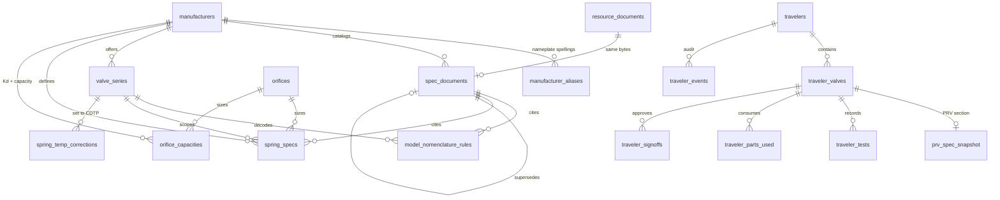

# PRV / PSV Manufacturer Spec Architecture

Three-layer design for assembling manufacturer repair and test specifications from source PDFs, resolving them against nameplate data, and freezing approved values into repair travelers with citations.

**Stack:** Vite + React Router (this repo). Server logic lives in Supabase — Postgres functions + RLS for data rules; Edge Functions for the PDF citation proxy and future extraction jobs. No Next.js API routes.

---

## Goals

1. **Technician enters nameplate data** (manufacturer, model code, size code, orifice, **CDTP**, ASME section, operating temperature).
2. **Resolver assembles specs** from approved Layer 2 rows only, each with a citation to Layer 1 (`spec_documents` + physical page).
3. **Traveler snapshot** freezes the resolved payload at confirm time; no silent drift when spec books are updated later.
4. **Provenance is mandatory** — AI extraction never becomes `approved` without human review.

---

## Layer overview



| Layer | Purpose | Mutability |
|-------|---------|------------|
| **1 — Source documents** | PDF metadata (`spec_documents` → `resource_documents`, same Storage object) | Supersede, never hard-delete |
| **2 — Structured specs** | Queryable numbers + mandatory citations | Draft → review → **approved**; supersede, never hard-delete |
| **3 — Travelers** | AS-FOUND nameplate, frozen snapshots, tests, parts, signoffs | Append-only events; snapshots immutable after confirm |

---

## Layer 1 — Source documents

### One physical file

| Table | Role |
|-------|------|
| `resource_documents` | Browse/library view (Relief Valve Spec Books on Resources page). Storage in private **`spec-documents`** bucket. |
| `spec_documents` | Quality-cataloged spec metadata. `resource_document_id` FK → same Storage object. **Never copy bytes.** |

Promotion flow: quality admin/manager creates a `spec_documents` row pointing at an existing `resource_documents` row when cataloging a PDF for structured extraction.

### `spec_documents`

| Column | Type | Notes |
|--------|------|-------|
| `id` | `uuid` PK | |
| `manufacturer_id` | `uuid` FK → `manufacturers` | |
| `resource_document_id` | `bigint` FK → `resource_documents` | Same file as Resources library |
| `title` | `text` | |
| `doc_type` | `text` | `spring_chart`, `catalog`, `maintenance_manual`, … |
| `edition_label`, `revision_label` | `text` | |
| `effective_date` | `date` | |
| `superseded_by_id` | `uuid` FK → `spec_documents` | |
| `page_count` | `int` | |
| `external_url` | `text` | Original Drive / vendor link |
| `status` | `text` | `active`, `superseded` |

### Citation URLs (Edge Function)

Stable proxy: `/functions/v1/spec-doc-page/doc/{specDocumentId}/page/{n}`

1. Authenticates caller (any authenticated shop user may view).
2. Logs view to `spec_document_page_views` (who / when / doc + page).
3. Redirects to a freshly minted ~60-minute signed URL for the underlying `resource_documents.storage_path`.

Raw short-lived signed URLs are acceptable only inside transient review UI — traveler snapshot citations use the proxy URL.

---

## Layer 2 — Structured specs (citation contract)

Every Layer 2 table includes these **provenance columns**:

| Column | Type | Notes |
|--------|------|-------|
| `source_document_id` | `uuid` FK → `spec_documents` | Required when `status = approved` |
| `source_page` | `int` | **Physical** PDF page (1-based) — used by `#page=N` deep links |
| `printed_page_label` | `text` | Label printed on page (e.g. `C-12`) for human navigation |
| `source_quote` | `text` | Nullable excerpt |
| `source_bbox` | `jsonb` | Nullable `{x,y,w,h}` normalized 0–1 |
| `extraction_method` | `text` | `manual`, `ai_assisted`, `imported` |
| `confidence` | `numeric(5,4)` | Nullable 0–1 |
| `status` | `text` | `draft`, `in_review`, `approved`, `superseded` |
| `verified_by` | `uuid` FK → `auth.users` | Set on approve |
| `verified_at` | `timestamptz` | |
| `superseded_by_id` | `uuid` | Self-FK |

**Approval gate:** `assert_spec_row_approved(table, id)` — resolver and travelers MUST only consume `status = 'approved'` rows.

### Phase 1 tables

#### `manufacturers` *(existing — extended)*

Reused from travelers/inventory. Phase 1 adds `slug`, `notes`, `is_active`. **No spec-only copy.**

#### `manufacturer_aliases`

Maps nameplate spellings → canonical `manufacturer_id` (`F`, `Farris`, `A.G.`, `AG`, …).

#### `valve_series`

Per-manufacturer series (e.g. Farris 2600, Consolidated 1900).

#### `orifices`

API 526 effective areas only. **No Kd** — Kd is series/valve-specific.

API 526 designations D–T seeded as `status = 'draft'` pending Mike's confirmation against his API 526 copy.

#### `orifice_capacities`

Kd + rated capacity by `(manufacturer_id, valve_series_id, orifice_id)` with citations (typically National Board NB-18).

#### `model_nomenclature_rules`

Regex + `segment_map` decodes model codes into separate groups:

- series / orifice / bonnet / **spring-material-code** / option suffixes
- **size code** as its own field (e.g. `2.5J4` = 2.5 in inlet × J orifice × 4 in outlet)
- Anderson Greenwood pilot configs like `2730546/S1` → `lookup_key`, not regex-parseable

Example Farris production codes: `26JB12-121`, `26MA12-121`, `26QB22-151/SP`, `26HB12L-921/M1/SP`.

#### `spring_specs`

Spring chart rows. Lookup against **CDTP** (Cold Differential Test Pressure), not hot set pressure.

| Notable column | Notes |
|----------------|-------|
| `spring_material_code` | Parsed from model suffix (`-121`, `-151`, `-921`) — different materials, different ranges |
| `set_pressure_min/max` | Band containing CDTP at `reference_temp_f` |

**Spring match priority (resolver):**

1. Most specific match (exact series + orifice + size + spring-material-code beats generic).
2. Prefer current (non-superseded) catalog edition.
3. Narrowest pressure band still containing CDTP.
4. Still tied → return **all** candidates, `needsReview = true`. Never silently pick.

#### `spring_temp_corrections`

When CDTP is not supplied: derive from hot set pressure using manufacturer chart data (`series`, temp range, `factor` or `delta_psi`). **Do not hardcode ASME factors.**

---

## Layer 3 — Travelers (repair records)

**Extend the existing traveler model.** PRV is another valve type — one traveler list, one workflow, one permission model.

Add a section table (e.g. `prv_spec_snapshot`) hanging off the existing traveler/valve record the same way the welding section does. **No parallel `prv_traveler_*` tables.**

| Shared fields | Stay on existing `traveler_valves` / basic info |
|---------------|--------------------------------------------------|
| PRV-only nameplate + test fields | PRV section tables |
| `cdtp` | Column on `traveler_valves` (resolver input) |

### Snapshot payload shape

Each resolved field carries citation metadata including `source_page`, `printed_page_label`, and stable proxy URL.

---

## Resolver

Pure function: `resolveValveSpecs(input, context) → SpecResolution` in `src/lib/resolveValveSpecs.ts`.

### Phase 1 steps

1. Decode `modelCode` via approved `model_nomenclature_rules` (spring material code, size code, lookup keys).
2. Resolve `valve_series` + approved `orifice`.
3. Select `spring_specs` where **CDTP** ∈ `[min, max]` with match-priority rules above.
4. Return spring + citation; ambiguous or missing data → `needsReview: true`.

### Phase 2+ steps

Temp correction when CDTP missing → orifice capacities → tolerance → seat tightness → blowdown → rings → torque → repair kit list.

---

## Access control

| Role | Layer 1 + 2 |
|------|-------------|
| **Technicians** | Read-only — run resolver, view specs |
| **Quality admin/manager** (`quality_team_level in ('admin','manager')`) | Write — catalog docs, edit Layer 2, approve candidates |
| **Shop admin** | Write (via `can_write_spec_data()`) |

Spec control is a quality-system function under the VR program — not delegated to all quality team members.

---

## Cross-cutting rules

| Topic | Rule |
|-------|------|
| **Units** | Store canonical (`psig`, `°F`, `sq in`) with explicit unit column |
| **Deletion** | No hard-delete on approved specs; use `status` + `superseded_by_id` |
| **Manufacturer identity** | `public.manufacturers` is source of truth; `lookup_values.manufacturer` migration planned later |
| **Types** | `src/types/manufacturerSpec.ts`, `src/types/specResolution.ts` |

---

## Phase roadmap

| Phase | Scope |
|-------|--------|
| **1** *(this migration)* | `manufacturer_aliases`, `spec_documents` (FK resource), `valve_series`, `orifices`, `orifice_capacities`, `model_nomenclature_rules`, `spring_specs`, `spring_temp_corrections`, RLS, API 526 draft seed, `spec-doc-page` Edge Function, stub resolver |
| **2** | Tolerance, seat tightness, blowdown, ring, torque tables + resolver expansion + CDTP derivation |
| **3** | Parts / kits / series_part_map + extraction pipeline |
| **4** | `prv_spec_snapshot` traveler section + confirm UI |
| **5** | Admin review screen (PDF + candidate side-by-side) |

---

## Integration with current app

| Existing asset | Relationship |
|----------------|--------------|
| `public.manufacturers` | Canonical manufacturer FK |
| `public.travelers` + section tables | Extended with PRV section — not replaced |
| `resource_documents` / Relief Valve Spec Books | Library view; promoted to `spec_documents` without copying files |
| `lookup_values.manufacturer` | Free-text job forms; migrate to `manufacturers` later |

---

## Migration

Run the full file in Supabase SQL Editor:

`supabase/migration-spec-phase1-prv-specs.sql`

Then create the private Storage bucket:

`supabase/migration-spec-documents-bucket.sql`

Deploy Edge Function:

```bash
supabase functions deploy spec-doc-page
```

**Storage:** Relief Valve Spec Books upload once to private bucket `spec-documents`. `resource_documents.storage_path` points at that object; cataloguing creates `spec_documents` with `resource_document_id` (no second upload).